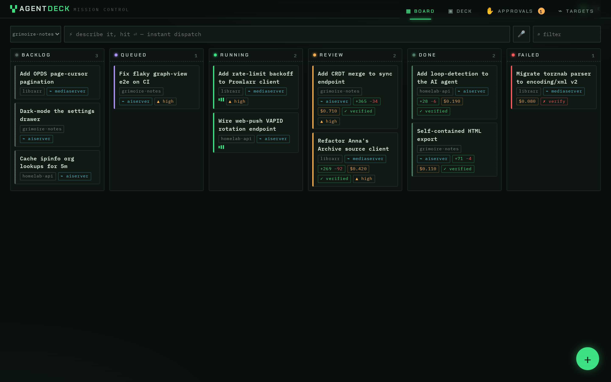
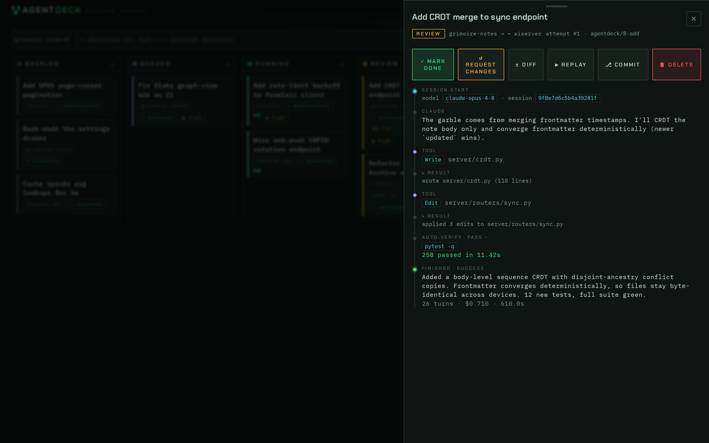
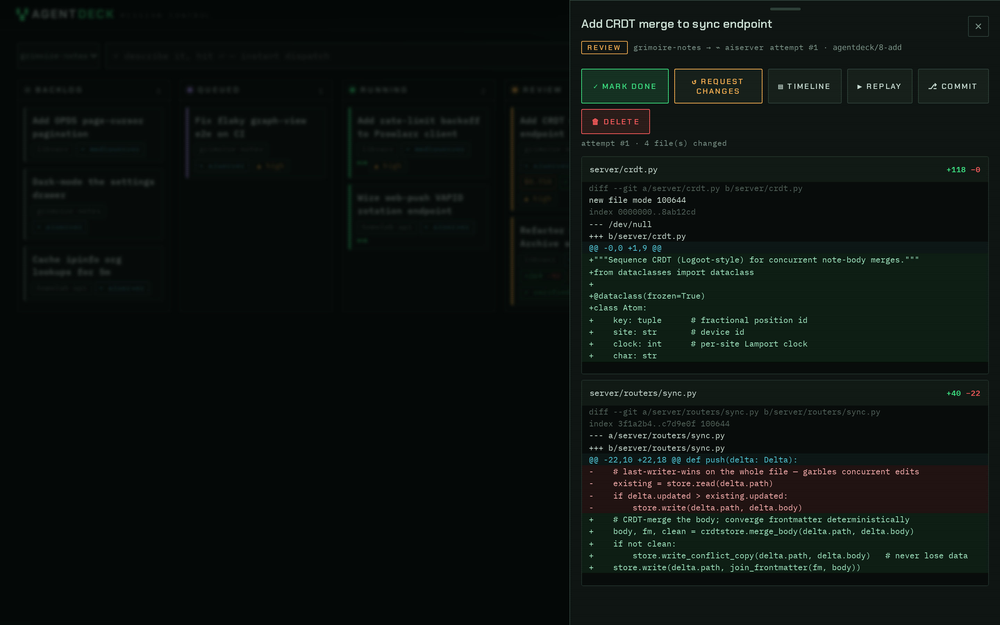
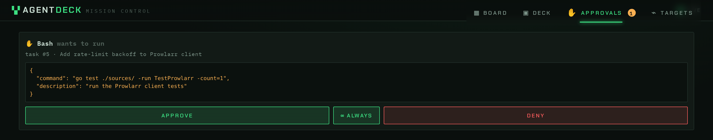
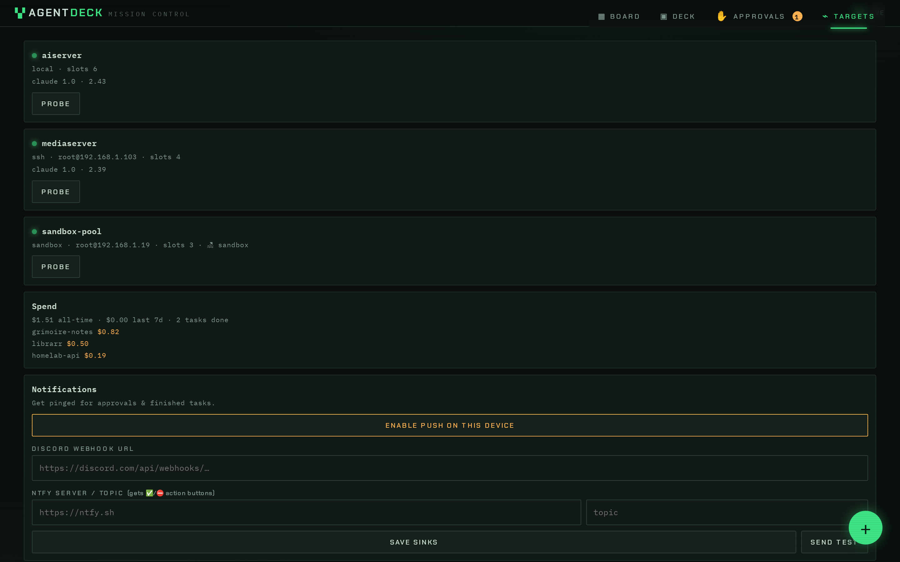
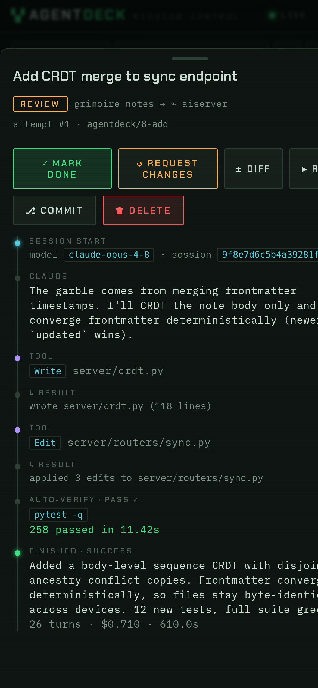

<div align="center">

# ▚▞ AgentDeck

**Mission control for AI coding agents — on your own infrastructure.**
Describe a task from your phone. An agent picks it up on a box you own, works in an
isolated git worktree inside tmux, streams every step live, pings you for approvals,
and hands you a reviewable diff.

<!-- badges -->




</div>

AgentDeck is a self-hosted kanban board that dispatches AI coding agents onto
**your** machines — anything you can SSH into, from a spare laptop or a VPS to a
Raspberry Pi or a Proxmox cluster. Every task runs sandboxed in its own git
worktree, streams a live timeline to a mobile-first PWA, and gates risky tool
calls behind approvals that hit your phone. Bring your own agent and your own
model. No SaaS, no shipping your code to someone else's cloud.

---

## Why it's different

**Runs on your hardware.** A target is any box with SSH — or the machine
AgentDeck itself runs on. Proxmox users get native extras (`pct` targets and
ephemeral `sandbox` containers cloned per task, destroyed after), but nothing
requires Proxmox. Your code and credentials never leave your network.

**Built for your phone.** The whole control loop — dispatch, live timeline, mobile
diff review, approve/deny — is designed thumb-first. Approvals arrive as web-push,
Discord, or ntfy notifications (ntfy carries approve/deny buttons inline).

**Any agent, any model — including fully local.** Claude Code, Codex, and
Gemini ship with adapters, and the adapter seam is small enough to add your
own. Point a project's `env` at any Anthropic-compatible endpoint (Ollama,
LiteLLM, vLLM) to drive whatever model you run.

## Quick start

```bash
docker compose -f deploy/docker-compose.yml up -d    # → http://localhost:9110
```

<details>
<summary>…or run from source</summary>

```bash
python3 -m venv .venv && .venv/bin/pip install -r requirements.txt
.venv/bin/python -m server                # → http://<host>:9110
```
</details>

Kick the tires with **zero setup** — mock mode ships a full demo board with fake
agents (no git/tmux/claude needed):

```bash
AGENTDECK_MOCK=1 .venv/bin/python -m server
```

Then register a target + project in the **Targets** tab (or `POST /api/targets` /
`POST /api/projects`) and dispatch from the board. A real target needs only SSH
reachability, `git`, `tmux`, `python3`, and your agent's CLI.

## A quick tour

| Live agent timeline | Mobile diff review |
|---|---|
|  |  |
| Every tool call, result, and auto-verify streamed as it happens. | Per-file diffs, reviewed and approved from anywhere. |

| Approvals that ping your phone | Targets & spend |
|---|---|
|  |  |
| Gate risky tool calls; approve, deny, or "always allow". | Health-probe every box; track cost per project. |

<div align="center">

<br><sub>The full operator loop, thumb-first.</sub>
</div>

## Features

- **Board** — kanban (mobile PWA + desktop), quick-dispatch bar, drag-to-dispatch,
  live SSE timeline, mobile diff review, and a desktop **Deck** multi-pane cockpit.
- **Targets** — `local` and `ssh` cover any machine; Proxmox users also get
  `pct` (no SSH needed) and `sandbox` (ephemeral container: clone → run →
  capture → destroy). Deep credentials probe included.
- **Agents** — adapters for Claude Code, Codex, and Gemini; a small seam for
  adding more; **any Anthropic-compatible endpoint** (local models via
  `ANTHROPIC_BASE_URL`).
- **Control loop** — hook-gated approvals with web-push + Discord/ntfy sinks, an
  always-allow policy engine, follow-ups, auto-verify, reviewer gates, A/B parallel
  attempts, agents that file their own task cards, and shared project memory.
- **Ops** — worktree janitor, cost stats, task templates, one-click ttyd terminal
  attach, and an **MCP server** so any MCP client can file and steer tasks.

## Using local / alternative models

Set a project's `env` to route its agent at any Anthropic-compatible API:

```bash
curl -X POST .../api/projects -d '{
  "name":"myrepo","target_id":1,"repo_path":"/srv/myrepo",
  "env":{"ANTHROPIC_BASE_URL":"http://ollama-host:11434",
         "ANTHROPIC_AUTH_TOKEN":"ollama"}}'
# then dispatch with "model":"qwen3.5:35b-a3b" (or any served model)
```

> Driving *agentic* coding (tool calls, edits) needs a capable model — small local
> models often reply conversationally instead of acting. The transport works with
> any model; results depend on the model.

## Tests

```bash
.venv/bin/pytest      # 154 hermetic tests — unit + API + Playwright e2e (mock executor)
```

## Layout

```
server/          FastAPI control plane (SQLite, SSE, scheduler, executors)
server/executor/ local | ssh | pct | sandbox | mock target executors
hooks/hook.py    PreToolUse approval hook (stdlib-only, copied into worktrees)
web/             mobile-first PWA (vanilla ES modules, no build step)
tests/           unit / api / e2e (Playwright)
DESIGN.md        full design doc — architecture, feature catalog, roadmap
```

Config via env: `AGENTDECK_PORT` (9110), `AGENTDECK_DB`, `AGENTDECK_BASE_URL`
(URL targets use to reach this server for approval callbacks), `AGENTDECK_AUTH_TOKEN`
(optional bearer), `AGENTDECK_VAPID_PUBLIC`/`_PRIVATE` (web push), `AGENTDECK_MOCK`.

---

<div align="center">
<sub>MIT licensed · self-hosted · your code never leaves your network.</sub>
</div>
