<div align="center">

# AgentDeck

**Mission control for AI coding agents — on your own infrastructure.**
Describe a task from your phone. An agent picks it up on a box you own, works in an
isolated git worktree inside tmux, streams every step live, pings you for approvals,
and hands you a reviewable diff.

<!-- badges -->


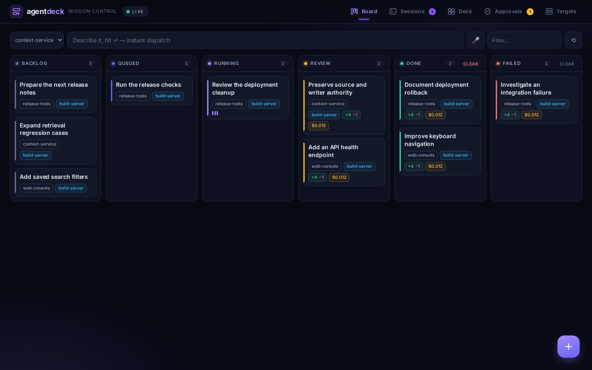

</div>

AgentDeck is a self-hosted kanban board that dispatches AI coding agents onto
**your** machines — anything you can SSH into, from a spare laptop or a VPS to a
Raspberry Pi or a Proxmox cluster. Every task runs sandboxed in its own git
worktree, streams a live timeline to a mobile-first PWA, and gates risky tool
calls behind approvals that hit your phone. Bring your own agent and your own
model. No SaaS, no shipping your code to someone else's cloud.

---

## Why it's different

**One binary, no runtime.** The control plane is a single static Go binary with
the PWA and the agent-side hook scripts embedded. Copy it to a box and run it.

**Tasks *and* sessions.** A task is work you hand off — dispatch, walk away,
review a diff. A **session** is an agent you work *with*, for days: it lives in
tmux, agentdeck watches its status and screen, you attach with one tap, type into
it from your phone, and when its context fills up you ask it to write a handoff
and hand the thread to a fresh one. It will also *discover and adopt* the Claude
and Codex sessions you started yourself, without disturbing them.

**Runs on your hardware.** A target is any box with SSH — or the machine
AgentDeck itself runs on. Proxmox users get native extras (`pct` targets and
ephemeral `sandbox` containers cloned per task, destroyed after), but nothing
requires Proxmox. Your code and credentials never leave your network.

**Built for your phone.** The whole control loop — dispatch, live timeline, mobile
diff review, approve/deny — is designed thumb-first. Approvals arrive as web-push,
Discord, or ntfy notifications (ntfy carries approve/deny buttons inline).

**Any agent, any model — including fully local.** Claude Code, Codex, and
Gemini ship with adapters, and the adapter seam is small enough to add your
own. Point a project's `env` at any Anthropic-compatible endpoint (Ollama,
LiteLLM, vLLM) to drive whatever model you run.

## Quick start

```bash
docker compose -f deploy/docker-compose.yml up -d    # → http://localhost:9110
```

<details>
<summary>…or build the binary</summary>

```bash
go build -o agentdeck ./cmd/agentdeck
./agentdeck                                # → http://<host>:9110
```

One static binary with the PWA, the agent-side hook scripts and a pure-Go SQLite
driver embedded in it. Nothing to install alongside, nothing to `pip` at deploy
time — copy the file and run it.
</details>

Kick the tires with **zero setup** — mock mode ships a full demo board with fake
agents (no git/tmux/claude needed):

```bash
AGENTDECK_MOCK=1 ./agentdeck
```

Then register a target + project in the **Targets** tab (or `POST /api/targets` /
`POST /api/projects`) and dispatch from the board. A real target needs only SSH
reachability, `git`, `tmux`, `python3`, and your agent's CLI.

## A quick tour

These are real browser captures from a fresh temporary installation, populated
with generic projects and scripted agents. The walkthrough uses a separate
Grimoire vault for project memory; it never touches production data.

### Tasks, timelines, and review

| Live agent timeline | Per-file diff review |
|---|---|
| 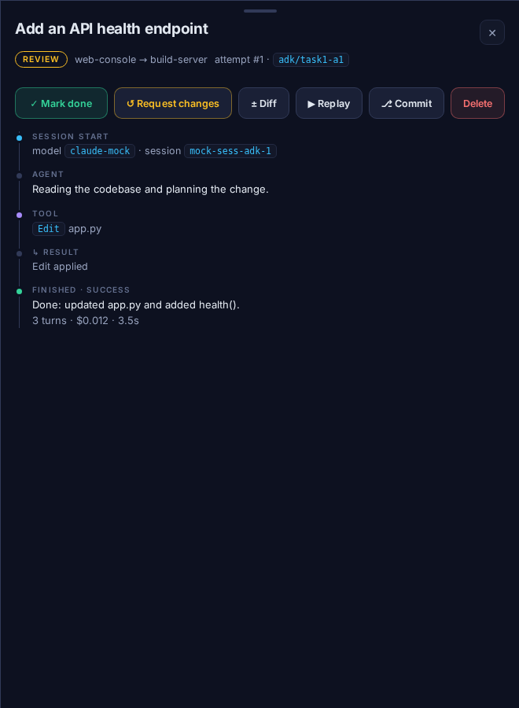 | 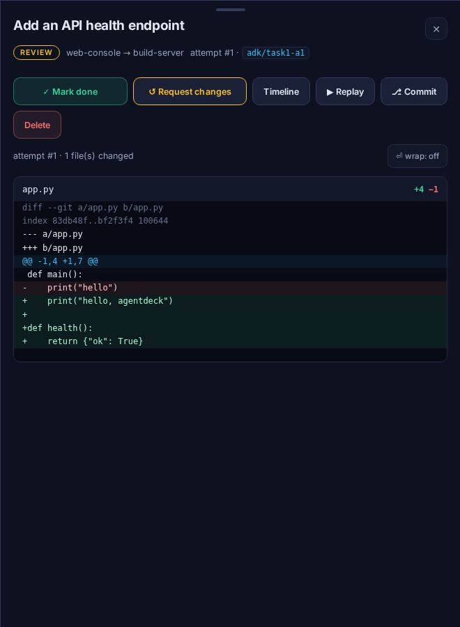 |
| Follow tool calls, results, and verification as they arrive. | Inspect the patch before completing a task. |

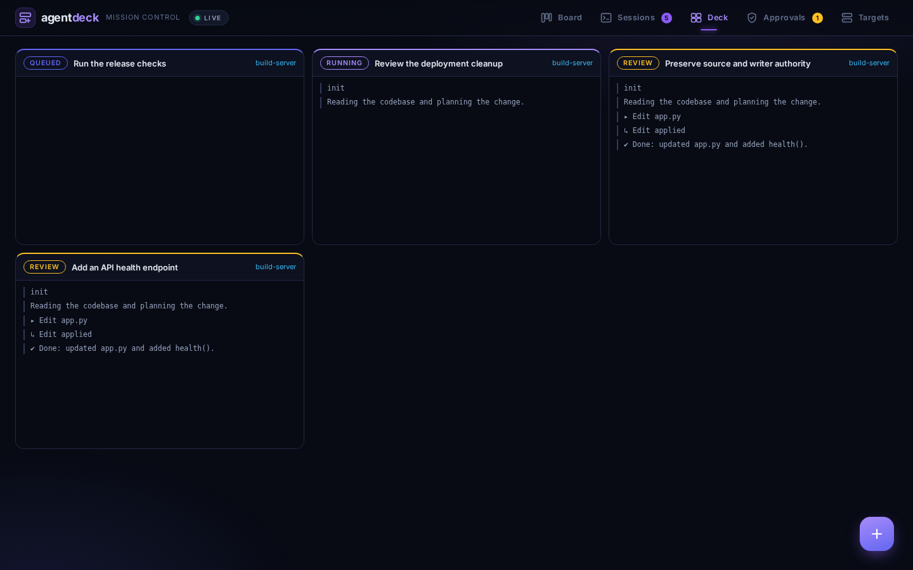

**Deck** keeps several task timelines visible side by side.

### Interactive sessions and continuity

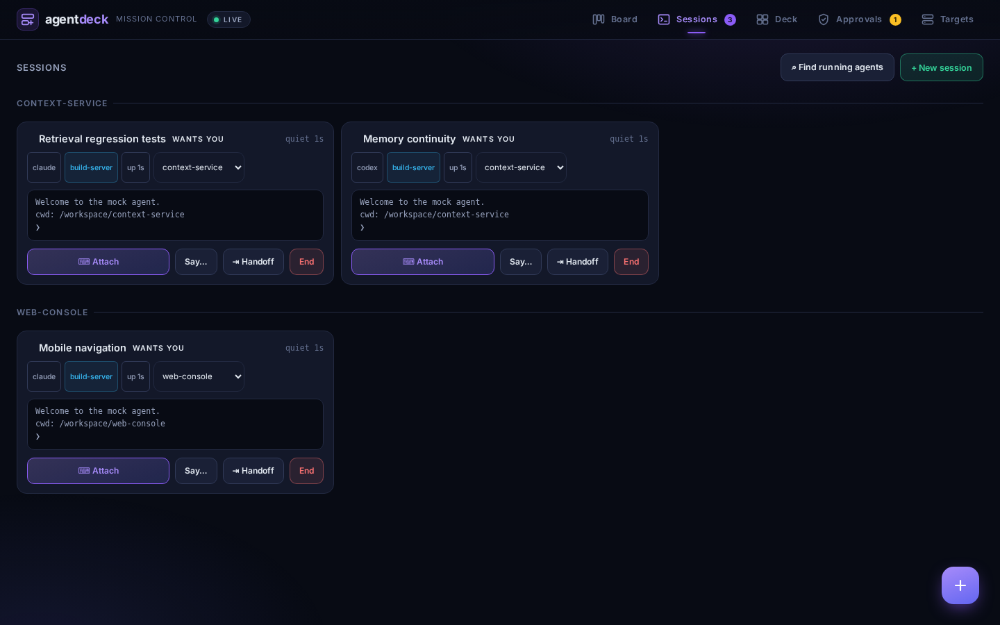

Attach to a session, send input, or hand the work to a fresh agent.

| Start with project context | Hand off between agents |
|---|---|
| 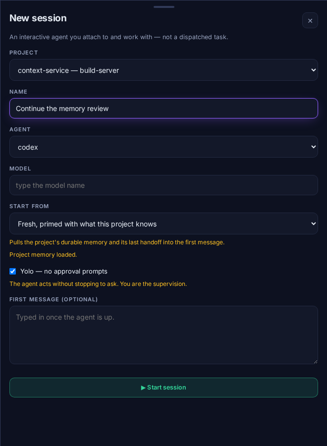 | 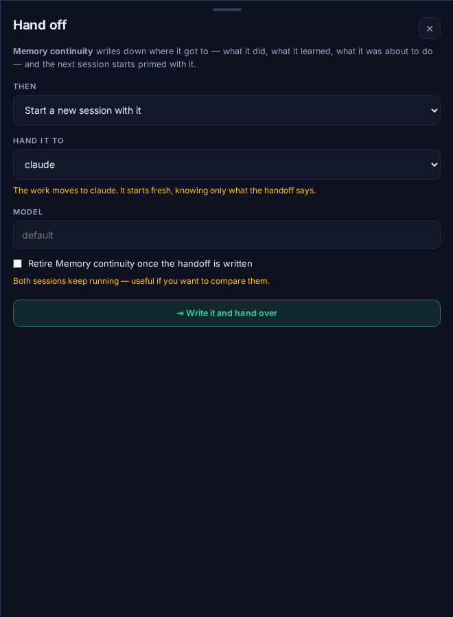 |
| See whether Grimoire memory loaded before starting. | Choose the successor and whether to retire the old session. |

### Saved routines

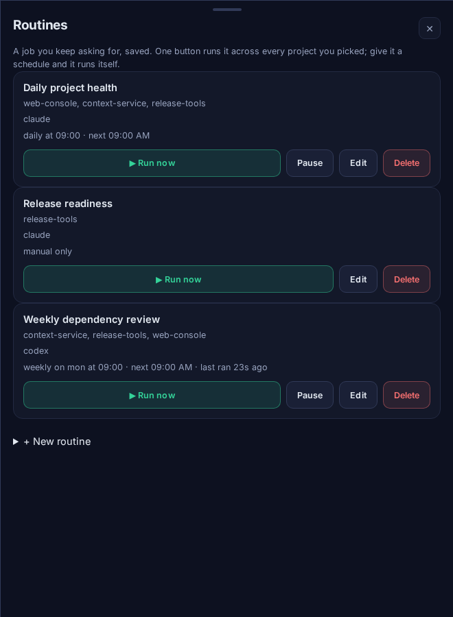

Save a recurring job once, choose its projects and agent, then run it now or on a
schedule. Pause, resume, and edit the same routine without creating duplicates.

<details>
<summary>Routine editor: projects, prompt, schedule, agent, model, and permissions</summary>

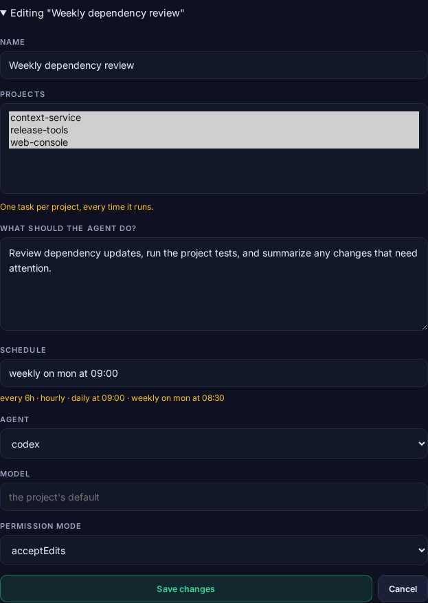

</details>

### Approvals and configuration

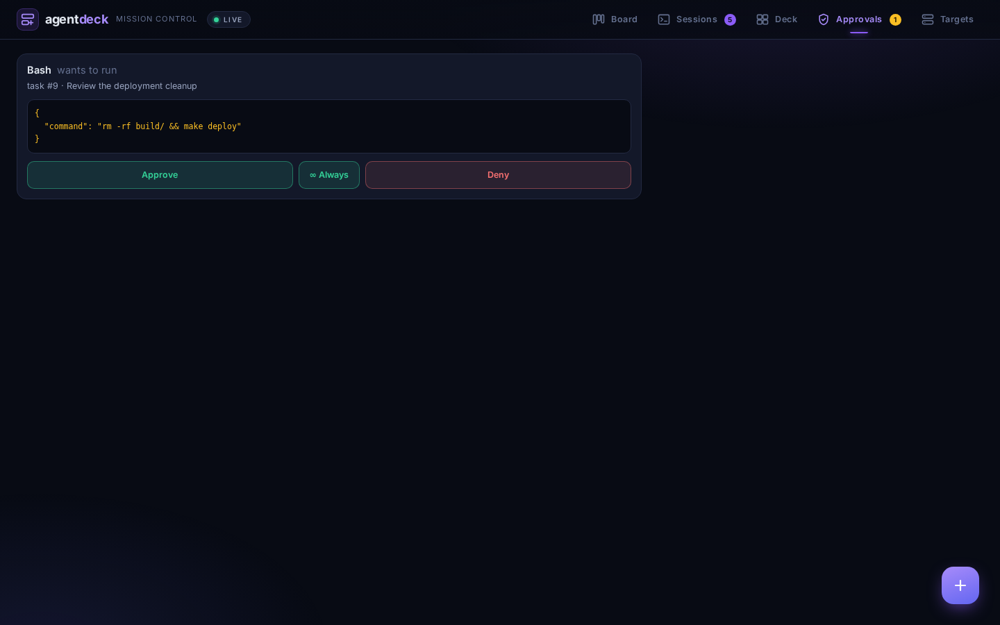

Review the actual tool request and approve or deny it from desktop or phone.

| Targets and running build | Project capabilities |
|---|---|
| 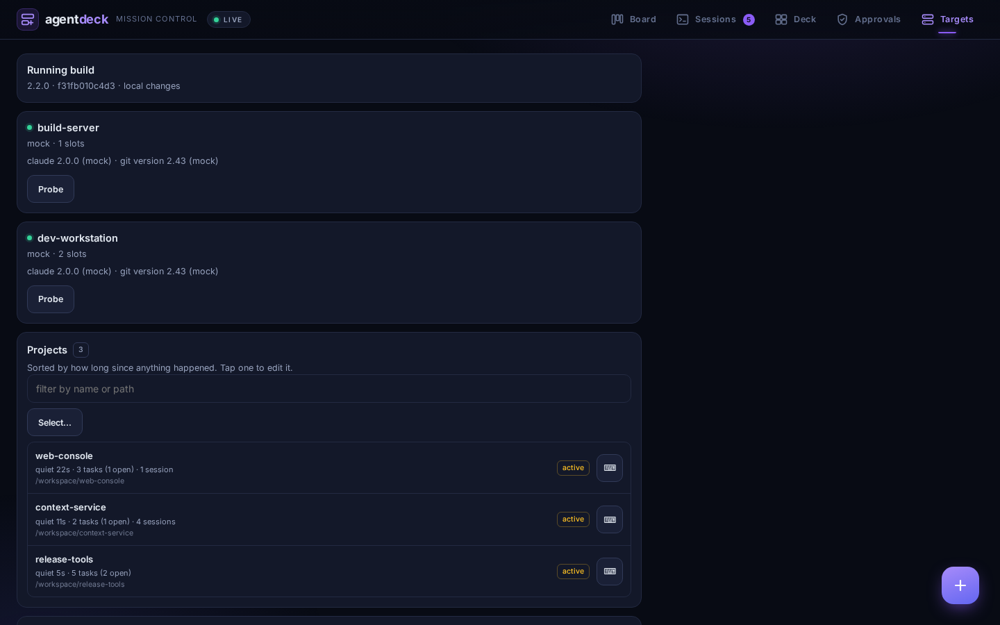 | 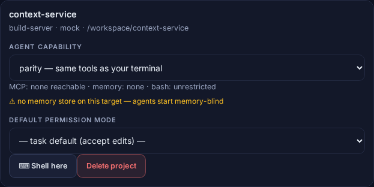 |
| Check installed agents and identify the deployed version. | Configure the context and tools available to each project. |

<details>
<summary>Spend by project</summary>

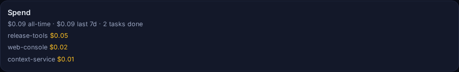

</details>

### On your phone

<p align="center">
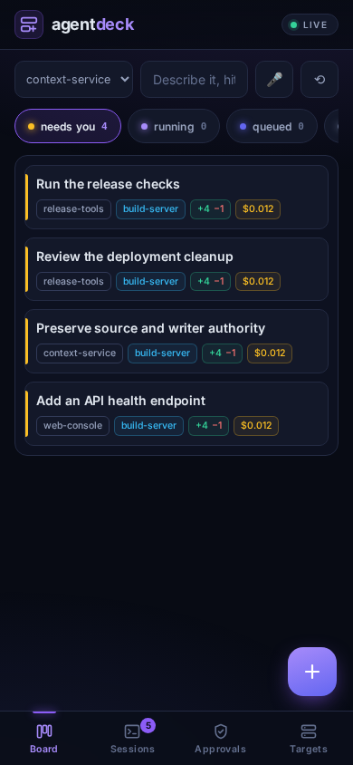
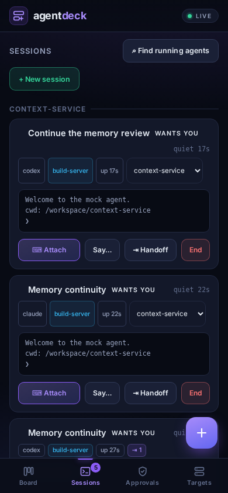
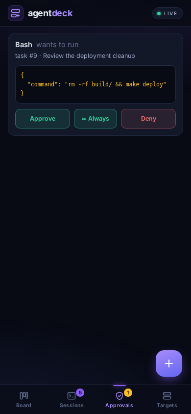
</p>

<details>
<summary>Mobile routines</summary>

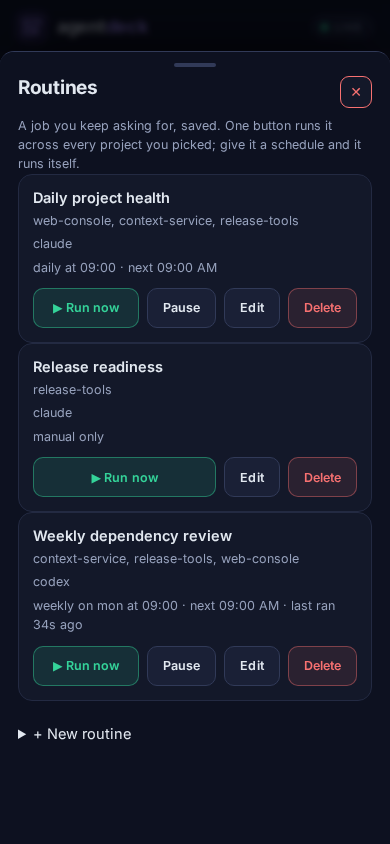

</details>

<details>
<summary>Reproduce the gallery and fresh-install walkthrough</summary>

With Go, Playwright, and Chromium installed:

```bash
.venv/bin/python tools/screenshots.py --grimoire-bin /path/to/grimoire
```

Omit `--grimoire-bin` to run without the memory companion. Both services use
temporary storage and loopback ports, and stop when the script exits. No paid
agent calls or notification sinks are used. The script checks target probes,
routine creation/editing/pause/resume/execution, column clearing, completed
handoffs, session setup, mobile approval, project settings, and database
persistence across a restart. It also fails on uncaught browser errors.

The generated [capture report](docs/screenshots/capture-report.json) lists the
checks and images. Mock execution tests the control plane; real agent CLI and
SSH integrations are covered separately by the test suite.

</details>

## Features

- **Context continuity** — Grimoire briefs retain source, trust, and human/agent
  authority. Session setup distinguishes unavailable memory, partial retrieval,
  and a successful search with no relevant notes; starting work stays available.
- **Completed handoffs** — a fresh agent starts only after its predecessor
  publishes a complete handoff with a marker unique to that request. Partial or
  stale files cannot retire the old session.
- **Running build** — Targets shows the serving binary's version, commit, and
  whether it includes local changes. Missing build metadata is shown as unknown.

- **Board** — kanban (mobile PWA + desktop), quick-dispatch bar, drag-to-dispatch,
  live SSE timeline, mobile diff review, and a desktop **Deck** multi-pane cockpit.
- **Sessions** — long-lived interactive agents, grouped by project. Live status
  (working / wants you / idle) derived from the pane itself, uptime and idle time
  taken from tmux's own clock, a preview of what is on screen, one-tap terminal
  attach, send-a-message and interrupt from your phone, **discovery + adoption**
  of agents you started by hand, and **handoff**: the agent writes a wrap for its
  successor, which starts primed with it. The project outlives the context window.
- **Blank rooms** — start any agent CLI in a throwaway git repository with no
  project attached, for work that does not have a name yet. When it turns into
  something, promote it: the directory it has been working in becomes the
  project's repository, so nothing moves, the tmux session keeps running, and
  the project is immediately dispatchable.
- **Import** — point it at where your code lives; it registers everything that
  looks like a project (git repo, build manifest, or a HANDOFF.md).
- **Targets** — `local` and `ssh` cover any machine; Proxmox users also get
  `pct` (no SSH needed) and `sandbox` (ephemeral container: clone → run →
  capture → destroy). Deep credentials probe included. A per-target
  `command_prefix` handles hosts whose SSH lands somewhere other than the work —
  `wsl -e bash -lc "echo {b64} | base64 -d | bash"` makes a Windows box with its
  toolchain in WSL an ordinary target.
- **Agents** — Claude Code, Codex and Gemini ship built in. Sessions take **any
  CLI**: define one in `PUT /api/agents` with its command, model flag, resume
  args and env, and it appears in the picker — the board holds no opinion about
  which binary is in the terminal. Local models work the same way for sessions as
  for tasks, through a project's `env`. See [docs/agents.md](docs/agents.md).
- **Control loop** — hook-gated approvals with web-push + Discord/ntfy sinks, an
  always-allow policy engine, follow-ups, auto-verify, reviewer gates, A/B parallel
  attempts, agents that file their own task cards, and shared project memory.
- **Context parity** — staged context files, per-project MCP servers, and
  permission rules, so an agent on a remote target knows and can do what one on
  your own machine does ([docs/context-parity.md](docs/context-parity.md)).
- **Ops** — worktree janitor, cost stats, task templates, one-click ttyd terminal
  attach, and an **MCP server** so any MCP client can file and steer tasks.

## Using local / alternative models

Set a project's `env` to route its agent at any Anthropic-compatible API:

```bash
curl -X POST .../api/projects -d '{
  "name":"myrepo","target_id":1,"repo_path":"/srv/myrepo",
  "env":{"ANTHROPIC_BASE_URL":"http://ollama-host:11434",
         "ANTHROPIC_AUTH_TOKEN":"ollama"}}'
# then dispatch with "model":"qwen3.5:35b-a3b" (or any served model)
```

> Driving *agentic* coding (tool calls, edits) needs a capable model — small local
> models often reply conversationally instead of acting. The transport works with
> any model; results depend on the model.

## Tests

```bash
go test ./...     # 334 tests, a temp database each
pytest -q e2e     # 36 Playwright browser flows against a real built binary
```

Most of those run against a mock executor — no git, tmux or agent binary — so
they are fast and hermetic. A handful deliberately do not: `e2e_real_test.go`
dispatches into a real git worktree, starts a real tmux session, runs a real
process and reads back its real diff and exit code, and `restart_test.go` runs
two App lifetimes over one database file. Those are the tests that catch what
mocks accept: argv that a real shell truncates, a launch race that only exists
once a process starts, a base branch that `git init` did not create. They skip
themselves if `git` or `tmux` is missing.


## Layout

```
cmd/agentdeck/       the binary
internal/api/        REST + hook endpoints, SSE streams, embedded PWA
internal/scheduler/  promotes queued attempts, tails running ones, finalises
internal/executor/   local | ssh | pct | sandbox | mock target executors
internal/agents/     per-agent launch commands and stream parsers
internal/hooks/      PreToolUse approval hook + agent kit (stdlib Python, embedded)
internal/store/      SQLite schema and typed row accessors
web/                 mobile-first PWA (vanilla ES modules, no build step)
e2e/                 Playwright browser tests
DESIGN.md            full design doc — architecture, feature catalog, roadmap
```

Pair it with a memory store — `AGENTDECK_GRIMOIRE_URL` gives sessions a project
briefing to start from and a place for handoffs to live. agentdeck works fine
without one; the two compose, they do not depend on each other.

Config via env: `AGENTDECK_PORT` (9110), `AGENTDECK_DB`, `AGENTDECK_BASE_URL`
(URL targets use to reach this server for approval callbacks), `AGENTDECK_AUTH_TOKEN`
(optional bearer), `AGENTDECK_VAPID_PUBLIC`/`_PRIVATE` (web push), `AGENTDECK_MOCK`.

---

<div align="center">
<sub>MIT licensed · self-hosted · your code never leaves your network.</sub>
</div>
